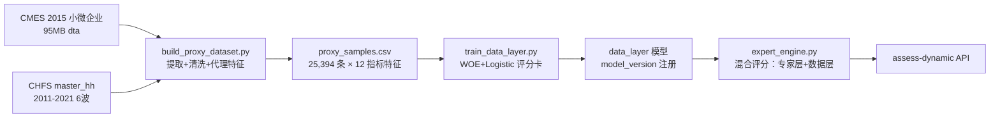
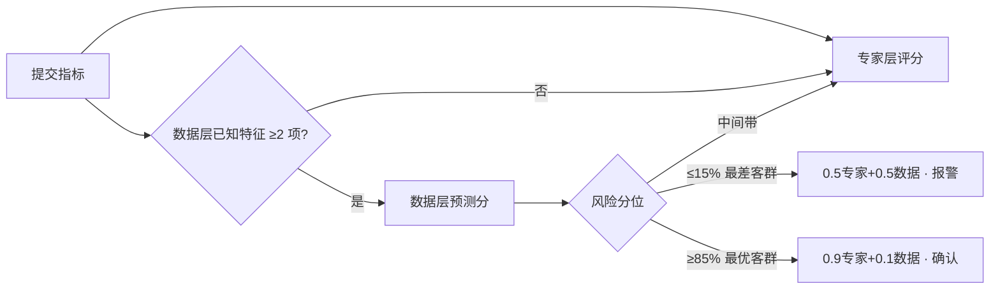

# 数据管道（Phase 3）说明

> 目标：把真实调查数据（CMES/CHFS）映射到 775 项动态指标体系，构建代理特征矩阵并训练**数据层评分卡**，与专家层组成**混合评分引擎**。

## 管道流程图



## 执行顺序（幂等，可重复运行）

```bash
# 1. 数据源→指标 映射字典入库（data_source_mapping，36 条）
python scripts/build_mapping.py            # --check-only 仅校验

# 2. 提取 CMES/CHFS 关键字段 → 构建代理样本（data/samples/proxy_samples.csv）
python scripts/build_proxy_dataset.py

# 3. 训练数据层评分卡并注册模型版本（默认 CMES，AUC≈0.77）
python scripts/train_data_layer.py        # --source cmes|all

# 4. 业务类型配置种子（层级权重 + 混合经营协同因子）
python scripts/seed_business_config.py
```

## 数据源映射（data_source_mapping 36 条）

| 数据源 | 关键字段 | 映射指标 | 可信度 |
|---|---|---|---|
| CMES | a1006 实际经营开始年份 | BASIC_003/BASIC_004 经营年限 | 0.78 |
| CMES | c1002 目前员工数 | BASIC_005 从业人员数 | 0.80 |
| CMES | bi3006/bi3011 农产品/畜牧销售收入 | BASIC_008 年营业收入 | 0.78/0.72 |
| CMES | bi2101/bi2101a 土地面积/流转面积 | 01_05 土地经营总面积 | 0.80 |
| CMES | bi3001_1..6 粮经作物面积 | 0111_01 谷物播种面积（加总） | 0.80 |
| CMES | bi3001_3 玉米面积 | 0111_05 玉米种植面积 | 0.80 |
| CMES | e1021/e1023 贷款金额 | BASIC_019/1041_02 贷款余额 | 0.76 |
| CMES | e1014 是否有未还清贷款 | BASIC_011 信贷履约记录 | 0.78 |
| CHFS | total_income/agri_inc/busi_inc | BASIC_008 年营业收入 | 0.80 |
| CHFS | agri_asset/land_asset | 01_05 经营规模（代理） | 0.74 |
| CHFS | agri_debt/busi_debt | BASIC_019 经营性贷款余额 | 0.80 |
| CHFS | total_debt/total_asset | BASIC_009 资产负债率 | 0.76 |

多源融合（用户确认决策）：按可信度加权平均；冲突时质量降级（存疑/代理）。

## 代理样本（proxy_samples.csv）

- **25,394 条**：CMES 5,422 + CHFS2015 11,772 + CHFS2021 8,200
- 违约标签：真实调查数据无违约标注，用可解释风险因子（营收/年限/负债率/贷款）合成，违约率≈6%
- 12 个指标编码特征：BASIC_003/004/005/008/009/019、01_05、0111_01/05/08、0112_04、1041_02

## 数据层评分卡

- **CMES-only 训练**（目标客群小微企业，AUC≈0.77 / KS≈0.45 / 召回≈49%）
- 入选特征：BASIC_004 实际经营年限（IV=1.40）、BASIC_005 从业人员数（IV=0.20）
- 注册为 `model_type=data_layer` 的 **inactive 附加模型**（不替换主评分卡）
- 训练群体评分分位数存于 metrics_json.scoreQuantiles，供运行时风险分位映射

## 混合引擎（expert_engine 集成）



- 触发时在评估结果的 `overrides` 记录 `data_layer:score=xxx([特征列表])`，可在评估记录详情查看
- 演示场景：专家看好（高营收/大面积）但经营年限短、人员少 → 数据层报警，评分下调

## 其他修复

- **MODEL_DIR/SAMPLE_DIR 绝对路径化**（app/core/config.py）：修复后端从任意 cwd 启动时模型/样本加载失败（此前仪表盘显示"信用模型 未加载"）
- `model_artifact.load_scorecard` 兼容历史相对路径
